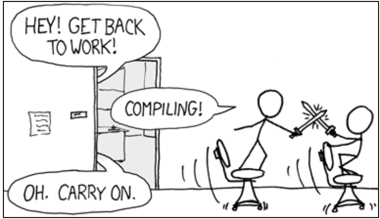

# Rust 视界周刊 Week 1
---
2023/01/07

## 社区热点

### Rust 官方正在讨论 为 Rust 提供 interoperable_abi features gate

[interoperable_abi](https://github.com/rust-lang/rust/pull/105586) 意味着提供一个新的 Rust ABI   extern "interop"  和 repr(interop) ，用于实现有安全数据 类型的高级编程语言之间的互操作性。 

动机摘要：

目前 Rust ABI 并不稳定，多语言交互只能通过 C-ABI 来进行。但是这限制了在 ABI 之间使用更高级的安全类型。可互操作的 ABI 将定义一种标准方法来跨高级语言进行调用，传递高级数据类型，而不需要将其降级为 C-ABI。该 ABI 将与任何提供
C 兼容 FFI 的语言（包括 C本身），并且语言还可以为可互操作的 ABI 添加特定的更高级别的支持。可互操作的 ABI 旨在成为
静态和动态形式的编译库（包括系统库）的合理默认值。

可互操作的 ABI 将是 C ABI 的严格超集。

可互操作 ABI 不支持的内容摘要：

- 可互操作的 ABI 并不旨在支持整个Rust 标准库.
- 可互操作的 ABI 不会旨在支持复杂的生命周期处理
- 可互操作的 ABI（至少在第一个版本中）不会以源代码或编译形式提供接口描述语言（IDL）
- 可互操作的 ABI 的目的不是在不同语言的表示之间提供“翻译”
- 可互操作的 ABI 不能支持任意的编译时泛型函数

### GCC-rs 项目在 2022 年取得了很大进展

gccrs是一个旨在为 GNU Compiler Collection 带来对 Rust编程语言的支持的项目。其目标是从头开始为 Rust 编程语言编写一个新的编译器前端，将该前端集成到 GCC 中，使其作为一种语言与 C、C++、Ada、D、Go 一起使用。

该项目最初于 2014 年启动。当时，Rust 尚未实现稳定版本（Rust 1.0 于 2015 年 5 月发布），对于单个开发人员来说很难跟上高强度的变化。2019年又开始努力，此后一直在稳步进行。

2020 年，菲利普·赫伦 ( Philip Herron )开始获得资金支持，随后他得以开始全职从事该项目。此赞助来自 Open Source Security公司。Philip 受雇于 Embecosm 并从他们的管理中受益，并得到 GCC 指导委员会的支持。2022 年，在将近一年半的单飞之后，Philip 加入了另一位由 Open Source Security 公司资助的全职工程师 Arthur Cohen ，也受雇于 Embecosm。现在有两名工程师每周为该项目投入 40 小时。

2022 年发生的最引人注目的事件是将 gccrs 合并到 GCC，gccrs 将在 2023 年 4 月发布的 GCC 13.1 版本中可用。

[更多内容参考 gccrs 2022 年报](https://rust-gcc.github.io/reporting/2022-year-report.html)

> P.S 与 gccrs 对应的是另一个项目 `rustc_codegen_gcc`。它是作为 Rust 编译器 GCC 后端，目前也正在积极开发中，感兴趣可以关注[rustc_codegen_gcc：进度报告#19](https://blog.antoyo.xyz/rustc_codegen_gcc-progress-report-19)。

### 用 Rust 和 C++ 代码编译时间同样糟糕吗？

[原文](https://quick-lint-js.com/blog/cpp-vs-rust-build-times/)作者写道：

> C++ 因其缓慢的构建时间而臭名昭著。“我的代码正在编译”是编程世界中的一个梗，而 C++ 让这个笑话流传开来。

> 像 Google Chromium 这样的项目 在全新硬件上构建需要一个小时，在旧硬件上构建需要 6 小时。即使有数千美元的云计算能力，Chromium 构建时间仍然在六分钟左右。这是我完全不能接受的。人怎么可以每天这样工作？

作者也听说，Rust 也面临相同的问题，但他有实证精神，亲自动手证明一下 Rust 是不是和 Cpp 一样很慢。

这是他的计划：

- 查找开源 C++ 项目。
- 从项目中提取一部分为迷你项目中。
- 将 C++ 迷你项目的代码逐行重写为 Rust。
- 优化 C++ 项目和 Rust 项目的构建工具链。
- 比较两个项目之间的编译+测试时间。

经过这样的测试，作者得出最终结论：

- 编译时间是 Rust 的问题吗？是的。有一些提示和技巧可以加快构建速度，但作者没有找到神奇的数量级改进，否则作者将很高兴使用 Rust 进行开发。
- Rust 的构建时间和 C++ 一样糟糕吗？是的。对于更大的项目，Rust 的开发编译时间比 C++ 更短，至少作者的代码风格是这样。
- 对于完整构建，C++ 构建花费的时间与 Rust 相比，大致相同（17k SLOC）或花费更少的时间（100k+ SLOC），而不是更长。
- 对于增量构建，与 C++ 相比，Rust 构建有时更短，有时更长（17k SLOC）或更长（100k+ SLOC），但并不总是更长。
- 很欣赏 Rust 的工具链（尤其是 Cargo、rustup 和 miri）。

## 应用实践

### Gama 发射的太阳帆宇宙飞船中使用了 Rust

[Gama](https://www.gamaspace.com/) 将发射太阳帆宇宙飞船🛰️，并且是公开将 Rust 送入太空的公司之一。提供软件服务的应该是这家公司：[Tweedegolf](https://tweedegolf.nl/en) ，该公司也是 Rust 基金会银牌会员。他们的[开源仓库](https://github.com/tweedegolf)里有一个 Rust 实现的 PTP (精确时间协议) 库，这个PTP一般用在卫星的时间源，比NTP更精确。但这个是 PoC 实现，不知道这次发射的飞船上有没有用。从另外的项目 嵌入式开发板 pcf85063a （一般用于计时闹钟）rust 驱动来看，这次上天的 Rust 程序很可能和精确计时相关。

[Gama 太阳帆的卫星于 2023 年 1 月 3 日由 SpaceX 猎鹰 9 号成功送入轨道](https://www.sail-world.com/news/257330/Gama-launches-its-Gama-Alpha-solar-sail-mission)。

## 生态看点

### svix-webhooks： 企业级 Webhooks 服务

[svix-webhooks](https://github.com/svix/svix-webhooks) 是基于 Rust 实现的企业级 Webhooks 服务器。Svix 使开发人员可以轻松发送 webhook。开发人员进行一次 API 调用，Svix 负责可交付性、重试、安全性等。

### turmoil：开发和测试分布式系统的框架

[Tokio 发布了](https://tokio.rs/blog/2023-01-03-announcing-turmoil)用于开发和测试分布式系统的框架 [turmoil](https://github.com/tokio-rs/turmoil) 的初始版本。

测试分布式系统很难。不确定性无处不在（网络、时间、线程等），使得难以实现可重现的结果。由于部署，开发周期很长。所有这些因素都会减慢开发速度，并且难以确保系统的正确性。turmoil力求通过模拟主机、时间和网络来解决这些问题。这允许整个分布式系统在单个线程的单个进程中运行，从而实现确定性执行。

### cargo-sandbox 发布

[cargo-sandbox](https://github.com/insanitybit/cargo-sandbox) 打算成为 cargo 的一个近乎直接的替代品。关键的区别在于，cargo-sandbox 在 docker 容器中运行相关命令，目的是将潜在的恶意代码与主机环境的隔离开来（关于威胁模型的更多细节，见README）。 其目标是尽可能地接近 "100%"的兼容原版 cargo，并获得最顺畅的体验。

### Rust 中的深度学习：Burn 0.4.0 发布以及 2023 年的规划

Rust 深度学习框架[Burn](https://github.com/burn-rs/burn) 0.4 完成了后端重构，除此之外，还实现了很多新的功能，如ADAM优化器、转化器模块等。下一个重点将是增加视觉相关的模块，如卷积和池化层。

### shura-一个安全的2D 游戏引擎，易于创建易于管理的游戏

[shura](https://github.com/AndriBaal/shura) 是rust编写的一个安全，快速并且跨平台的游戏框架。shura使用一个2D组件系统、场景管理和group系统帮你管理一个大型游戏。

shura主要的目标是，你的游戏逻辑可以分别放在不同的组件、group和场景中。

### rumqtt: 构建  mqtt  的 Rust 生态

[rumqtt](https://github.com/bytebeamio/rumqtt) 是一组用 rust-lang 编写的开源库，用于实现 MQTT 标准，同时力求简单、健壮和高性能。

rumqtt 是 Bytebeam 物联网咨询公司开源的 MQTT 代理。rumqtt 目前版本已经发布到了 R19 版，并未按语义化版本来发布。

目前发布了 R19 新版本：

- 新的版本提升了性能和可靠性（可以支持 多达 10,000 多个 MQTT 客户端，使用 [mqttwrk](https://github.com/bytebeamio/mqttwrk) 进行基准测试）
- 添加了一个用于测试 rumqttd 的公共服务器
- 添加了 Prometheus 集成和其他优化更改
- 加了对存储支持的持久性的实验性支持，以确保消息的零数据丢失

rumqtt 将在 2023 年初推出对 MQTT v5 的支持。

> P.S 另外一个纯 Rust MQTT v5 客户端实现 [mqrstt](https://github.com/GunnarMorrigan/mqrstt)