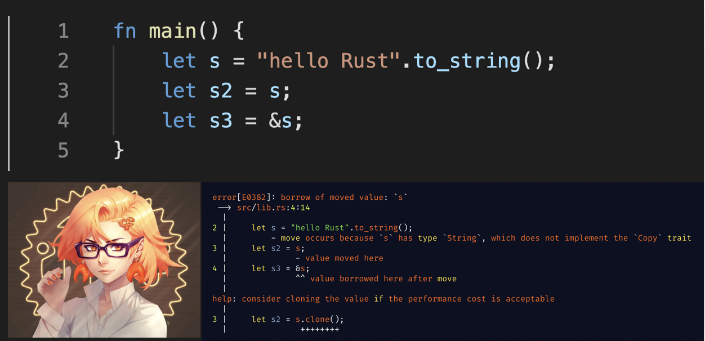

# Rust 视界周刊 Week 4 ｜ Fish Shell 将会从 Cpp 迁移到 Rust 实现
---

## 社区热点

### 这是你心目中的 Rust 女性化形象吗？


搭配编译器错误信息看呢？



### Rust 1.67 稳定版发布

[Rust 1.67 稳定版发布了](https://github.com/rust-lang/rust/blob/master/RELEASES.md#version-1670-2023-01-26) 。

以下摘录三个值得关注的语言特性。

## 让 `Sized` trait 可共归纳（Coinductive）

在 1.67 之前，下面代码编译不通过：

```rust
struct Node<C: Trait<Self>>(C::Assoc);

trait Trait<T> {
    type Assoc;
}

impl<T> Trait<T> for Vec<()> {
    type Assoc = Vec<T>;
}

fn main() {
    let _ = Node::<Vec<()>>(Vec::new());
    // <Vec<()> as Trait<Node<Vec<()>>>>  
    // Node( <Vec<()> as Trait<Node<Vec<()>>>>::Assoc )
}
```

报错如下：

```rust
error[E0275]: overflow evaluating the requirement `Node<Vec<()>>: Sized`
  --> src/main.rs:12:13
   |
12 |     let _ = Node::<Vec<()>>(Vec::new());
   |             ^^^^^^^^^^^^^^^^^^^^^^^^^^^
   |
note: required because of the requirements on the impl of `Trait<Node<Vec<()>>>` for `Vec<()>`
  --> src/main.rs:7:9
   |
7  | impl<T> Trait<T> for Vec<()> {
   |         ^^^^^^^^     ^^^^^^^

For more information about this error, try `rustc --explain E0275`.
```

这个[错误码`E0275`](https://doc.rust-lang.org/error_codes/E0275.html)表示在在解析某些类型限定时存在无限递归。具体到上面代码，是计算`Node<Vec<()>>: Sized` 的 `Sized` 限定时产生了无限递归。

上面代码 `Sized` 的正常推理逻辑是：

1. 如果 `<Vec<()> as Trait<Node<Vec<()>>>::Assoc` 是 `Sized`，则要求 `Node<Vec<()>>` 是 `Sized` 。
2. 这就要求 `Vec<Node<Vec<()>>` 是 `Sized`，因此再次需要 `Node<Vec<()>` 是 `Sized`。

这就造成了递归。在 1.67 stable 之后，[`Sized` 现在是共归纳（coinductive）](https://github.com/rust-lang/rust/pull/100386/)，就不会再次报错。

> 说明：共归纳（coinductive）是类型理论里的术语，用于处理递归类型。

###  `#[must_use]` 现在支持 `async fn`

`#[must_use]` 作用于 `async fn` 则会影响到 `Future::Output`，意味着下面异步函数：

```rust
#[must_use]
async fn bar() -> u32 { 0 }

async fn caller() {
    bar().await;
}
```

在未使用 `Future::output` 时会输出下面警告：

```rust
warning: unused output of future returned by `bar` that must be used
 --> src/lib.rs:5:5
  |
5 |     bar().await;
  |     ^^^^^^^^^^^
  |
  = note: `#[warn(unused_must_use)]` on by default
```

### `std::sync::mpsc` 合并了 `crossbeam_channel` 的 mpsc 

`std::sync::mpsc`现在被[切换为基于`crossbeam-channel`](https://github.com/rust-lang/rust/pull/93563/)。这次合并是为了解决 `std::sync::mpsc` 多年未解决的 Bug，以及提高了实现的性能和可维护性，并不包含任何 API 更改。

所以，如果你需要使用 `mpmc` channel，则还需要使用 `crossbeam-channel` 第三方库。使用 `mpsc` 的话，则用标准库的就可以了。

### 内存安全会议报告出炉

2022年10月27日，Consumer Reports举办了一个线上会议，讨论如何鼓励更广泛地采用内存安全的语言来写代码。有25位大佬参加了会议，包括教育界，学术界，政府，工业界和技术社区。

现在[内存安全大会报告](https://advocacy.consumerreports.org/wp-content/uploads/2023/01/Memory-Safety-Convening-Report-1-1.pdf)已出炉，其中提到：

- 大约 60%-70% 的浏览器和内核漏洞是由内存不安全造成的，其中许多问题都可以通过使用内存安全的语言来解决。虽然内存不安全的语言（C/Cpp）的开发人员可以尝试避免这些语言中的缺陷，但是经验表明，个人专业知识无法解决系统性问题。即使投入大量精力和资源检测、修复和缓解此类问题，内存不安全任然继续代表着大多数严重性安全漏洞和稳定性问题。重要的是，不仅仅要改进对内存不安全问题的检测，还要加大力度对其从一开始就进行防范。
- 呼吁行业中需要更加关注内存安全问题。呼吁企业中应该对此进行宣传，提高安全意识，而不仅仅是软件工程师，还有面向产品经理，提高他们的安全意识。
- 从教育到企业在推广教育和使用内存安全语言路上目前还有一些阻碍，呼吁整个行业要进行转变。

小结：内存安全大会呼吁整个行业重视内存安全问题，对行业人员对安全意识进行宣传和提升，并且结合实际情况逐步推广内存安全语言（比如 Rust）。这条路还任重道远。


## 应用实践

### Rust 更适合 serverless

社区有人发布了一份 [Lambda冷启动分析](https://maxday.github.io/lambda-perf/)报告网站，分析结果展示 Rust 更适合用于 serverless，冷启动速度一流。

也可以自行根据[Lambda冷启动分析性能测试源码](https://github.com/maxday/lambda-perf)运行测试。

### Fish Shell 将会从 Cpp 迁移到 Rust 实现

Fish 是"the friendly interactive shell"的简称，最大特点就是方便易用。很多其他 Shell 需要配置才有的功能，Fish 默认提供，不需要任何配置。当前由 Cpp 实现，Fish shell 用户量庞大。

近日，来自 [fish-shell 仓库的PR](https://github.com/fish-shell/fish-shell/pull/9512) 显示，Fish Shell 即将用 Rust 重写，更精准的描述是，将会从 Cpp 迁移到 Rust 实现。

> 没有人真正喜欢C++或CMake，它给人带来的痛苦与日俱增，C++正在成为一种历史语言，在未来贡献者会越来越少，而Rust有一个活跃和不断增长的社区。
> 用Rust编写新的 Fish shell 是非常现代和有意义的，实际上，这应该被认为是 "移植 "而不是 "重写"，因为我们不会从头开始；
> 相反，我们会在一个版本的时间内将C++翻译成Rust，一个模块一个模块地渐进进行。我们将使用FFI，这样Rust和C++的部分就可以互相交流，保证每次提交时测试和CI都能通过，直到C++完全被替换，

### Rust 实现的类异星工厂游戏 Combine_And_Conquer 已上 steam 平台

[Combine_And_Conquer](https://store.steampowered.com/app/2220850/Combine_And_Conquer/) 是一个类似于异星工厂（factorio） 的游戏，纯 Rust 实现，没有使用任何开源 Rust 游戏引擎，作者也一直在其网站编写[Combine_And_Conquer 的开发日志](https://buckmartin.de/combine-and-conquer.html)。

### lodestone: 基于 Tauri 实现的游戏自托管工具

[lodestone](https://github.com/Lodestone-Team/lodestone) 是基于 Tauri 实现的适用于 Minecraft 和其他多人游戏的免费开源服务器托管工具。

后端 [lodestone_core](https://github.com/Lodestone-Team/lodestone_core) 使用 Rust 实现。


## 生态看点

### Symphonia: 纯 Rust 实现的音频解码和多媒体解复用库

[Symphonia](https://github.com/pdeljanov/Symphonia) 为 100% Safe Rust代码实现。

支持 MP4/M4A, OGG, MKV/WebM, WAV 媒体格式和AAC-LC, ADPCM, ALAC, FLAC, MP1/2/3, Vorbis, PCM，MP1, MP2, and MS/IMA ADPCM音频格式。

在[Symphonia 最新的性能基准测试](https://github.com/pdeljanov/Symphonia/blob/master/BENCHMARKS.md)中，Symphonia 解码花费的平均相对时间在处理一些格式时已经优于 FFmpeg。


### Catalytic ： 用于 ScyllaDb 和 Cassandra 的 ORM

Scylla 和 Cassandra 都是 NoSQL 数据库，可以水平扩展并保存大量数据。[Catalytic](https://github.com/Jasperav/Catalytic) 则为 ScyllaDb 和 Cassandra 零成本抽象出 ORM。

#### ormlite: 另一个简单的 ORM

[ormlite](https://github.com/kurtbuilds/ormlite) 基于 sqlx 和 tokio 实现。

### scotch: WASM 插件系统

[scotch](https://github.com/ItsEthra/scotch) 可以方便地创建 WASM 插件系统，基于 [wasmer](https://github.com/wasmerio/wasmer) 实现。Scotch 允许开发者将复杂类型传递给 WASM 插件中的函数或从中传递复杂类型。它通过在 Host 和 Guest 环境之间传递时对复杂类型进行编码和解码来实现这一点。

P.S 关于 WASM 作为通用插件系统相关文章：[https://reorchestrate.com/posts/plugins-for-rust/](https://reorchestrate.com/posts/plugins-for-rust/)

### num-ord: 安全的跨类型数字比较

[num-ord](https://github.com/orlp/num-ord)提供了一个包装类型 `NumOrd`，以数学上正确的方式为内置整数类型的所有可能组合实现了 `PartialOrd` 和 `PartialEq` trait ，而没有溢出。

[num-ord 作者写了一篇文章介绍跨类型比较数字中存在的问题](https://orlp.net/blog/ordering-numbers/)。甚至 ChatGPT 也没法写出一个正确的跨类型比较大小的函数，尤其涉及浮点数时。

```rust
// ChatGPT 的实现：
/// x <= y
fn is_less_eq(x: i64, y: f64) -> bool {
    x as f64 <= y
}
```

事实上，不能简单地将 i64 强转为 f64 来比较。正确的方法是，将浮点数四舍五入到最接近的整数后在整数域进行运算。

```rust
fn is_less_eq(x: i64, y: f64) -> bool {
    if y.is_nan() { return false; }
    if y >= 9223372036854775808.0 { // 2^63
        true // y is always bigger.
    } else if y >= -9223372036854775808.0 { // -2^63
        x <= y.floor() as i64  // y is in [-2^63, 2^63)
    } else {
        false // y is always smaller.
    }
}
```

### Druid 发布 v0.8

[Druid](https://linebender.org/druid/) 是一个 Rust 原生的 UI 工具包，用于构建针对 Windows/macOS/Linux/OpenBSD/FreeBSD 的桌面应用程序。经过 80 位贡献者两年的努力，今天发布了v0.8。

Druid 社区正在做的事情可以描述为三个部分：

- 首先，逐步放弃使用 Piet，而选择使用新颖的 GPU 加速 2D 渲染引擎 - Vello；
- 其次，改造 Druid 中的 druid-shell，将其变为更通用的 - Glazier，并不再依赖 Piet；
- 最后，停止 Druid 项目，启动更好数据架构的新项目 - Xilem。

### Gerb: 开源字体编辑器

[gerb](https://github.com/epilys/gerb) 是一个实验性的 GUI 字体编辑器，基于 gtk-rs 实现，需要依赖 gtk-3 。目前仍处于原型阶段。

### carbonyl: 在终端上运行 Chromium 浏览器

[carbonyl](https://github.com/fathyb/carbonyl) 是个神奇的项目，支持几乎所有的 Web API，包括 WebGL、WebGPU、音频和视频播放、动画等。当然，都是像素风格。

carbonyl 分为 core 和 runtime 两部分。core 中实现了 Rust 和 Chromium API 的桥接。runtime 会动态加载 core 库。[carbonyl 的博客](https://fathy.fr/carbonyl)中详细介绍了它使用的技术栈。

### argmin-rs 构建数值优化的 Rust 生态

[argmin-rs](https://argmin-rs.org/) 致力于构建数值优化的 Rust 生态。

> 数值优化(Numerical Optimization)对于最优化问题提供了一种迭代算法思路，通过迭代逐渐接近最优解，分别对无约束最优化问题和带约束最优化问题进行求解。数值优化在目前大数据时代的重要性不言而喻。无论是统计学，运筹学，应用数学等传统数学系的方向，还是机器学习，深度学习等人工智能的方向，你都可以看到数值优化的影子。学习参考 [复旦大学《数值优化》公开课](https://open.163.com/newview/movie/free?pid=NHJU1JJFK&mid=BHJU1JK4S)。

argmin-rs 生态系统由下面一些 crate 组成：

- [argmin](https://github.com/argmin-rs/argmin) ：优化算法和框架
- [argmin-math](https://crates.io/crates/argmin-math) ：数学后端抽象接口和各种版本的 `ndarray`、`nalgebra`和 `Vecs` 的实现。
- [argmin-testfunctions](https://github.com/argmin-rs/argmin-testfunctions) ：测试函数的集合
- [finitediff](https://github.com/argmin-rs/finitediff) : 有限微分
- [modcholesky](https://github.com/argmin-rs/modcholesky) ：改进的 cholesky 分解
- [sphrs](https://github.com/argmin-rs/sphrs) : 通用球谐函数和（规则和不规则）固体谐波库

目前， argmin 0.8.0 和 argmin-math 0.3.0 已发布，新版本特性参考[argmin 官方博客](https://argmin-rs.org/blog/version-v0-8-0/)。

###  airsim-client： Airsim Rust 客户端

[airsim-client](https://github.com/Sollimann/airsim-client) 是 Airsim 模拟器的 Rust 客户端。

[Airsim](https://github.com/Shelton117/AirSim) 是来自 Microsoft AI & Research 团队的基于虚拟引擎/Unity 构建的用于无人机，汽车等的场景模拟器，基于虚幻引擎（虚幻引擎4）。它是开源的，跨平台的，用于物理和视觉逼真的模拟。

### blaze：Rust 的 OpenCL 库

[blaze](https://github.com/Aandreba/blaze)是 Rust 编写的 OpenCL 库，目前发布了 v0.1.0 版本，还处于早期阶段。

### Aper : 基于状态机进行数据同步

[Aper](https://github.com/drifting-in-space/aper) 是一个基于状态机进行数据同步的Rust库。Aper提供了用状态机表示普通数据结构的机制，以及一个与传输无关的协议，用于保持状态机的多个实例在网络上的同步。

Aper 抽象了一个 `StateMachine` trait :

```rust
pub trait StateMachine: Clone + DeserializeOwned + Serialize + Debug + 'static {
    /// The [`StateMachine::Transition`] type associates another type with this state machine
    /// as its transitions.
    type Transition: Debug + Serialize + DeserializeOwned + Clone + PartialEq;
    type Conflict: Debug + Serialize + DeserializeOwned + Clone + PartialEq;

    /// Update the state machine according to the given [`Transition`]. This method *must* be
    /// deterministic: calling it on a clone of the state with a clone of the [`Transition`]
    /// must result in the same state, even at a different time and on a different machine. This
    /// is the requirement that allows Aper to keep the state in sync across multiple machines.
    fn apply(&self, transition: &Self::Transition) -> Result<Self, Self::Conflict>;
}
```

使用它需要确保状态更新都是确定性的。因为需要同步的每个客户端都以相同的顺序接收相同的转换（Transition），达到它们的状态同步更新，如果有 Conflict 则状态不更新。Aper 就像是用于数据结构的 Git。更多内容可以参考 [Aper book](https://aper.dev/guide/01-introduction.html)