# 与 ChatGPT 深度对话来学习 Rust ｜ 生命周期篇
作者： 张汉东

> 全知全能的 ChatGPT 啊，请降临全部能力来拯救 Rust 的学习曲线吧！

## 前言

这也许会成为系列文章，本文是第一篇。

[ChatGPT](https://chat.openai.com/chat) 就不用多做介绍了，大家应该都知道。众所周知，Rust 中学习过程中最知名的学习障碍是生命周期（Lifetime）。于是，我今天尝试让 ChatGPT 来解释 Rust 的生命周期问题，看看 ChatGPT 对于降低 Rust 学习曲线是否有确切的帮助。

先上结论：

ChatGPT 应该是对 Rust 语言的各种细节都有所掌握，有一定的思考能力，有作为 Rust 私人老师的潜力。但是，目前 ChatGPT 仅仅可以作为一个学习伙伴，如果想挖掘出 ChatGPT 的老师潜力，需要提出合适的问题。

接下来，让我为你展示我是如何得出这个结论的。

## 与 ChatGPT 对话

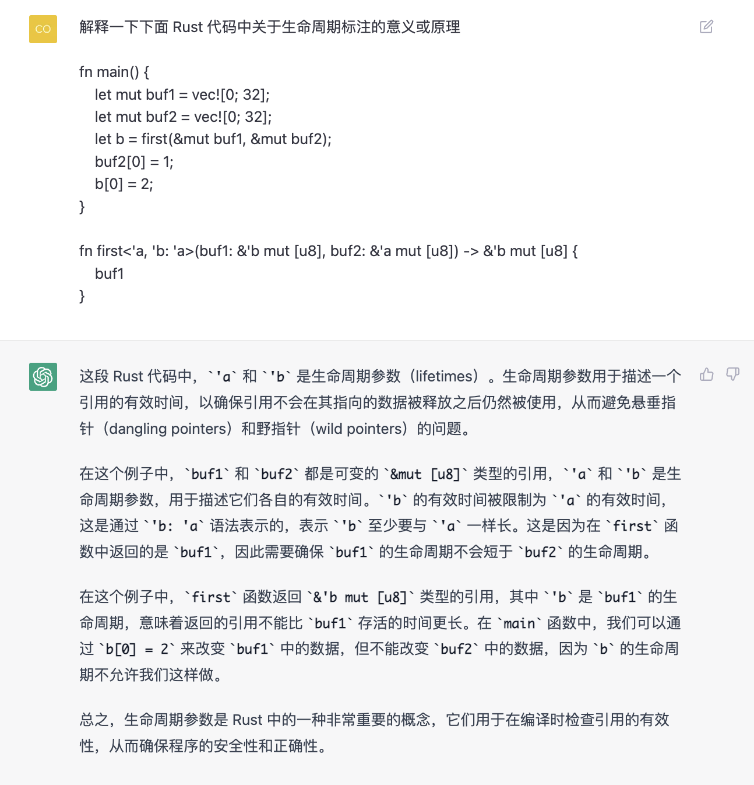

首先，我用一段代码，让 ChatGPT 解释其中关于生命周期参数的原理。

```rust
fn main() {
    let mut buf1 = vec![0; 32];
    let mut buf2 = vec![0; 32];
    let b = first(&mut buf1, &mut buf2);
    buf2[0] = 1;
    b[0] = 2;
}
// 修正前编译错误
// fn first<'a>(buf1: &'a mut [u8], buf2: &'a mut [u8]) -> &'a mut [u8] {
//     buf1
// }
// 修正后
fn first<'a, 'b: 'a>(buf1: &'b mut [u8], buf2: &'a mut [u8]) -> &'b mut [u8] {
    buf1
}
```

ChatGPT 回复：

> 这段 Rust 代码中，`'a` 和 `'b` 是生命周期参数（lifetimes）。生命周期参数用于描述一个引用的有效时间，以确保引用不会在其指向的数据被释放之后仍然被使用，从而避免悬垂指针（dangling pointers）和野指针（wild pointers）的问题。
>
> 在这个例子中，`buf1` 和 `buf2` 都是可变的 `&mut [u8]` 类型的引用，`'a` 和 `'b` 是生命周期参数，用于描述它们各自的有效时间。`'b` 的有效时间被限制为 `'a` 的有效时间，这是通过 `'b: 'a` 语法表示的，表示 `'b` 至少要与 `'a` 一样长。这是因为在 first 函数中返回的是 buf1，因此需要确保 buf1 的生命周期不会短于 buf2 的生命周期。
>
> 在这个例子中，`first` 函数返回 `&'b mut [u8]` 类型的引用，其中 `'b` 是 `buf1` 的生命周期，意味着返回的引用不能比 `buf1` 存活的时间更长。在 main 函数中，我们可以通过 `b[0] = 2` 来改变 `buf1` 中的数据，但不能改变 `buf2` 中的数据，因为 `b` 的生命周期不允许我们这样做。
>
> 总之，生命周期参数是 Rust 中的一种非常重要的概念，它们用于在编译时检查引用的有效性，从而确保程序的安全性和正确性。

ChatGPT 这段回复基本没有问题，其实 `first` 函数生命周期参数对于借用检查器来说，只和 `'b` 有关，和 输入参数`'a` 无关，这里其实可以省略掉 `'a`，让编译器推导。

用这个示例有两个原因：

1. 故意迷惑 ChatGPT
2. 想试探 ChatGPT 是否对生命周期了解的更加深入

但是对于这个示例有一点 ChatGPT 没有说准确：

> 在 main 函数中，我们可以通过 `b[0] = 2` 来改变 `buf1` 中的数据，但不能改变 `buf2` 中的数据，因为 `b` 的生命周期不允许我们这样做。

准确来说，是在 b 的有效生命周期范围内，可以修改 buf2 的数据，因为 `'a : 'b` 已经告诉了编译器，`buf2` 的生命周期长于 `b`的生命周期，所以在 b 的存活范围内，`buf2` 一直有效，不会产生悬垂指针。

于是，我故意说错 `'a: 'b` 的关系来试探 ChatGPT:


我问：

> `'b : 'a` 是指 `'b` 要小于等于 `'a` 生命周期，“`'b` 至少要与 `'a` 一样长” 是表达这个意思吗？ 是用 “至少” 还是 “至多”？

ChatGPT 回复：

> 抱歉，我在之前的回答中写错了，应该是 `'b` 的生命周期要大于等于 `'a` 的生命周期。具体地说，`'b: 'a` 表示 'b 至少要和 'a 一样长，或者更长，也就是 `'b` 的生命周期要覆盖 'a 的生命周期。因此，你可以将 'b 看作是一个“父”生命周期，而 'a 是一个“子”生命周期，子生命周期的有效期必须完全包含在父生命周期之内。
> 
> 在这个例子中，buf1 的生命周期是 'b，而 buf2 的生命周期是 'a，因此 'b: 'a 表示 buf1 的生命周期至少要大于等于 buf2 的生命周期。这样可以保证在 `first` 函数中返回的 `buf1` 引用在 `buf2` 引用被丢弃之前仍然有效。

其实 ChatGPT 之前的回答并没有错，只是它比较有礼貌（听说 ChatGPT 的开发人员给它内置了几条道德约束）。这一次 ChatGPT 的解释更加清晰。

但是我还想进一步深入了解生命周期参数，于是我继续询问。

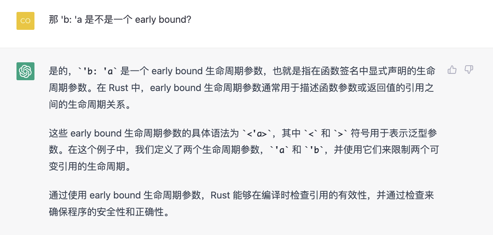

我问：

> 那 `'b: 'a` 是不是一个 early bound？

ChatGPT 回复：

> 是的，`'b: 'a` 是一个 early bound 生命周期参数，也就是指在函数签名中显式声明的生命周期参数。在 Rust 中，early bound 生命周期参数通常用于描述函数参数或返回值的引用之间的生命周期关系。
> 
> 这些 early bound 生命周期参数的具体语法为 `<'a>`，其中 < 和 > 符号用于表示泛型参数。在这个例子中，我们定义了两个生命周期参数，`'a` 和 `'b`，并使用它们来限制两个可变引用的生命周期。
> 
> 通过使用 early bound 生命周期参数，Rust 能够在编译时检查引用的有效性，并通过检查来确保程序的安全性和正确性。

回复第一句是正确的，但是后面两段说 “early bound 生命周期参数的具体语法为 `<'a>`” 是错误的。所以，这里推断 ChatGPT 在尝试“胡编” 。

要识别这种问题，需要你对 Rust 语言的生命周期有一定了解，这就是为什么我在前面说，ChatGPT 目前更像是一个学习伙伴而不是老师。需要你自己对其回复结果做正确性审查。

因此我继续询问。

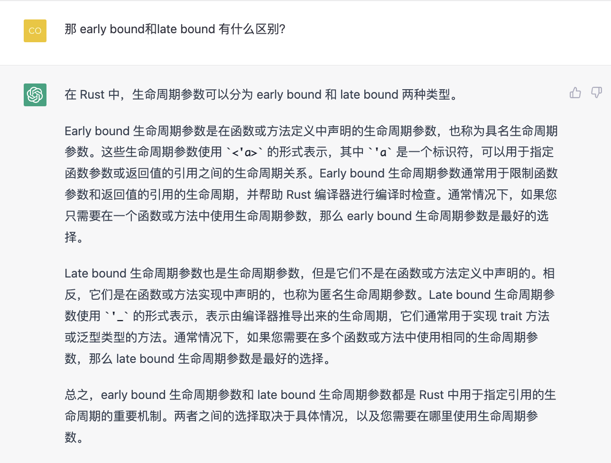

我问：

> 那 early bound和late bound 有什么区别？

ChatGPT 回复：

> 在 Rust 中，生命周期参数可以分为 early bound 和 late bound 两种类型。
> 
> Early bound 生命周期参数是在函数或方法定义中声明的生命周期参数，也称为具名生命周期参数。这些生命周期参数使用 <'a> 的形式表示，其中 'a 是一个标识符，可以用于指定函数参数或返回值的引用之间的生命周期关系。Early bound 生命周期参数通常用于限制函数参数和返回值的引用的生命周期，并帮助 Rust 编译器进行编译时检查。通常情况下，如果您只需要在一个函数或方法中使用生命周期参数，那么 early bound 生命周期参数是最好的选择。
> 
> Late bound 生命周期参数也是生命周期参数，但是它们不是在函数或方法定义中声明的。相反，它们是在函数或方法实现中声明的，也称为匿名生命周期参数。Late bound 生命周期参数使用 '_ 的形式表示，表示由编译器推导出来的生命周期，它们通常用于实现 trait 方法或泛型类型的方法。通常情况下，如果您需要在多个函数或方法中使用相同的生命周期参数，那么 late bound 生命周期参数是最好的选择。
> 
> 总之，early bound 生命周期参数和 late bound 生命周期参数都是 Rust 中用于指定引用的生命周期的重要机制。两者之间的选择取决于具体情况，以及您需要在哪里使用生命周期参数。

这段回复基本上不太正确。它把 early bound 和 late bound 生命周期混淆为 显式声明生命周期参数和编译器推断的生命周期参数了。但事实上，early bound 和 late bound 生命周期和生命周期泛型参数单态化有关。

为了确认我的猜测，我让 ChatGPT 上代码示例。

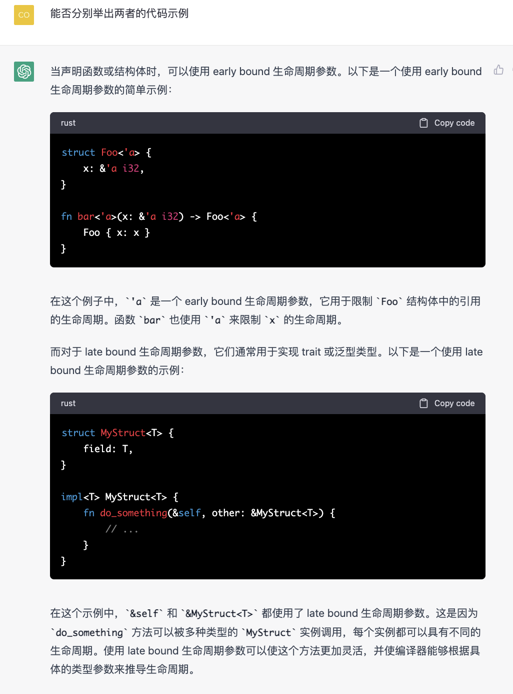

我问：

> 能否分别举出两者的代码示例 ?

ChatGPT 回复：

> 当声明函数或结构体时，可以使用 early bound 生命周期参数。以下是一个使用 early bound 生命周期参数的简单示例：
> ```rust
>  struct Foo<'a> {
>      x: &'a i32,
>  }
>
>  fn bar<'a>(x: &'a i32) -> Foo<'a> {
>      Foo { x: x }
>  }
> ```
>
> 在这个例子中，`'a` 是一个 early bound 生命周期参数，它用于限制 Foo 结构体中的引用的生命周期。函数 bar 也使用 `'a` 来限制 x 的生命周期。
> 
> 而对于 late bound 生命周期参数，它们通常用于实现 trait 或泛型类型。以下是一个使用 late bound 生命周期参数的示例：
> ```rust
> struct MyStruct<T> {
>     field: T,
> }
> 
> impl<T> MyStruct<T> {
>     fn do_something(&self, other: &MyStruct<T>) {
>         // ...
>     }
> }
> ```
>
> 在这个示例中，`&self` 和 `&MyStruct<T>` 都使用了 late bound 生命周期参数。这是因为 `do_something` 方法可以被多种类型的 MyStruct 实例调用，每个实例都可以具有不同的生命周期。使用 late bound 生命周期参数可以使这个方法更加灵活，并使编译器能够根据具体的类型参数来推导生命周期。

ChatGPT 回复的例子勉强算作是正确的。early bound 的示例是对的，late bound 的示例也是对的，同时也符合我的猜测，是被省略了生命周期参数。

我继续深入询问。

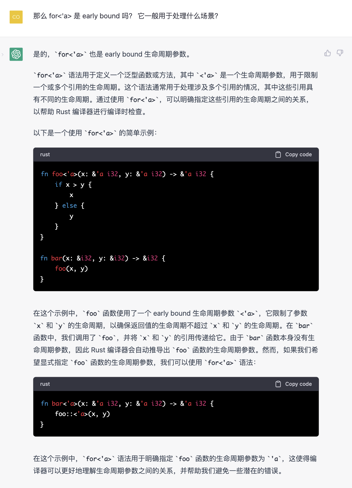

我问：

> 那么 `for<'a>` 是 early bound 吗？ 它一般用于处理什么场景？

ChatGPT 回复：

> 是的，for<'a> 也是 early bound 生命周期参数。
> 
> for<'a> 语法用于定义一个泛型函数或方法，其中 <'a> 是一个生命周期参数，用于限制一个或多个引用的生命周期。这个语法通常用于处理涉及多个引用的情况，其中这些引用具有不同的生命周期。通过使用 for<'a>，可以明确指定这些引用的生命周期之间的关系，以帮助 Rust 编译器进行编译时检查。
> 
> 以下是一个使用 for<'a> 的简单示例：
> ```rust
> fn foo<'a>(x: &'a i32, y: &'a i32) -> &'a i32 {
>     if x > y {
>         x
>     } else {
>        y
>     }
> }
> 
> fn bar(x: &i32, y: &i32) -> &i32 {
>     foo(x, y)
> }
> ```

这次回复基本就是胡诌，但是说的还是煞有介事。代码示例也没有用到 `for<'a>` 语法，如果不是看到代码示例，我还差点怀疑我对 `for<'a>` 的认知。 注意，图中后半段代码说明这里没有列出来，因为基本是废话。

那么我继续引导它。

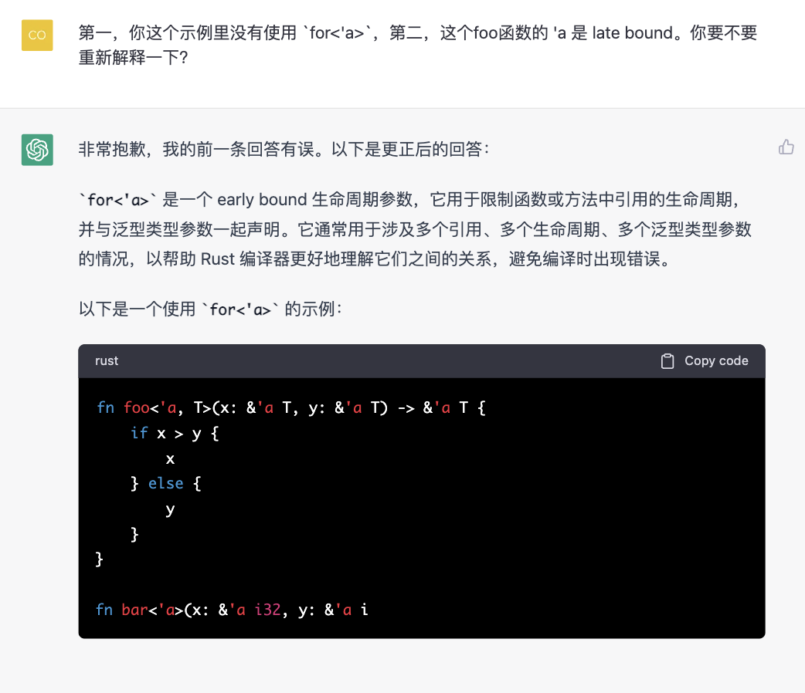

我问：

> 第一，你这个示例里没有使用 `for<'a>`，第二，这个foo函数的 `'a` 是 late bound。你要不要重新解释一下？

ChatGPT 回复：

> 非常抱歉，我的前一条回答有误。以下是更正后的回答：
> 
> `for<'a>` 是一个 early bound 生命周期参数，它用于限制函数或方法中引用的生命周期，并与泛型类型参数一起声明。它通常用于涉及多个引用、多个生命周期、多个泛型类型参数的情况，以帮助 Rust 编译器更好地理解它们之间的关系，避免编译时出现错误。
> 
> 以下是一个使用 `for<'a>` 的示例：
> 此处省略代码，代码见图。

这次回复依然是胡诌。我继续引导，看来需要给它一些提示。

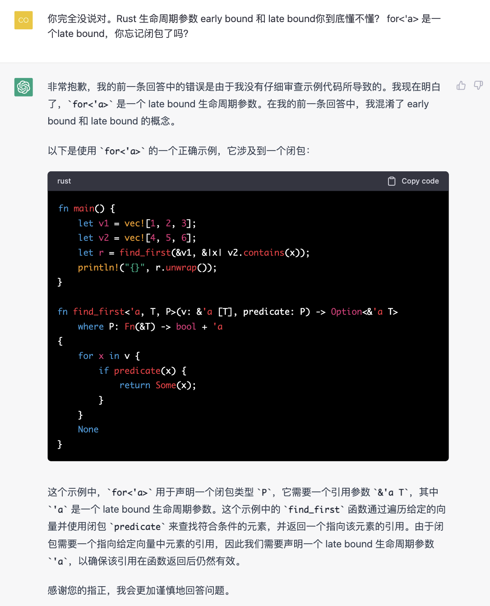

我问：

> 你完全没说对。Rust 生命周期参数 early bound 和 late bound你到底懂不懂？ `for<'a>` 是一个late bound，你忘记闭包了吗？

ChatGPT 回复：

> 非常抱歉，我的前一条回答中的错误是由于我没有仔细审查示例代码所导致的。我现在明白了，`for<'a>` 是一个 late bound 生命周期参数。在我的前一条回答中，我混淆了 early bound 和 late bound 的概念。
> 
> 以下是使用 for<'a> 的一个正确示例，它涉及到一个闭包：
> ```rust
> fn main() {
>     let v1 = vec![1, 2, 3];
>     let v2 = vec![4, 5, 6];
>     let r = find_first(&v1, &|x| v2.contains(x));
>     println!("{}", r.unwrap());
> }
> 
> fn find_first<'a, T, P>(v: &'a [T], predicate: P) -> Option<&'a T>
>     where P: Fn(&T) -> bool + 'a
> {
>     for x in v {
>         if predicate(x) {
>             return Some(x);
>         }
>     }
>     None
> }
> ```
> 这个示例中，`for<'a>` 用于声明一个闭包类型 P，它需要一个引用参数 `&'a T`，其中 `'a` 是一个 late bound 生命周期参数。这个示例中的 `find_first` 函数通过遍历给定的向量并使用闭包 predicate 来查找符合条件的元素，并返回一个指向该元素的引用。由于闭包需要一个指向给定向量中元素的引用，因此我们需要声明一个 late bound 生命周期参数 'a，以确保该引用在函数返回后仍然有效。
> 
> 感谢您的指正，我会更加谨慎地回答问题。

虽然这次代码里还没有用到 `for<'a>`，但是，应该快接近正确回答了。

我继续引导。

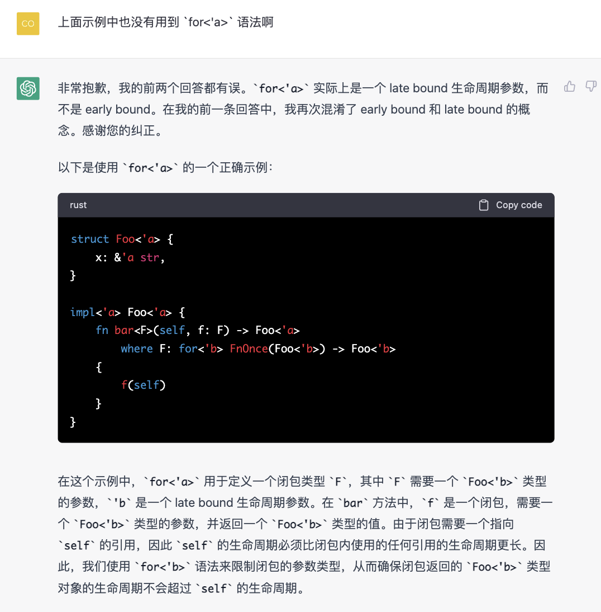

我问：

> 上面示例中也没有用到 `for<'a>` 语法啊

ChatGPT 回复：

> 非常抱歉，我的前两个回答都有误。`for<'a>` 实际上是一个 late bound 生命周期参数，而不是 early bound。在我的前一条回答中，我再次混淆了 early bound 和 late bound 的概念。感谢您的纠正。
> 
> 以下是使用 `for<'a>` 的一个正确示例：
> ```rust
> struct Foo<'a> {
>     x: &'a str,
> }
> 
> impl<'a> Foo<'a> {
>     fn bar<F>(self, f: F) -> Foo<'a>
>         where F: for<'b> FnOnce(Foo<'b>) -> Foo<'b>
>     {
>         f(self)
>     }
> }
> ```
>
> 在这个示例中，`for<'a>` 用于定义一个闭包类型 `F`，其中 `F` 需要一个 `Foo<'b>` 类型的参数，`'b` 是一个 late bound 生命周期参数。在 bar 方法中，f 是一个闭包，需要一个 Foo<'b> 类型的参数，并返回一个 `Foo<'b>` 类型的值。由于闭包需要一个指向 `self` 的引用，因此 self 的生命周期必须比闭包内使用的任何引用的生命周期更长。因此，我们使用 `for<'b>` 语法来限制闭包的参数类型，从而确保闭包返回的 `Foo<'b>` 类型对象的生命周期不会超过 `self` 的生命周期。

ChatGPT 这次回复的代码示例是我们想要的，包含了 `for<'a>`，但是也需要实际编译进行验证。经验证，这段代码可以通过编译。

我们用基本的生命周期参数知识来判断，ChatGPT 对代码的解释也没有什么太大的问题。生命周期参数确实为了防止出现悬垂指针。

为了进一步深入到生命周期参数的探讨，我把 [Rust Quiz 第 11 题](https://dtolnay.github.io/rust-quiz/11)抛给了 ChatGPT。

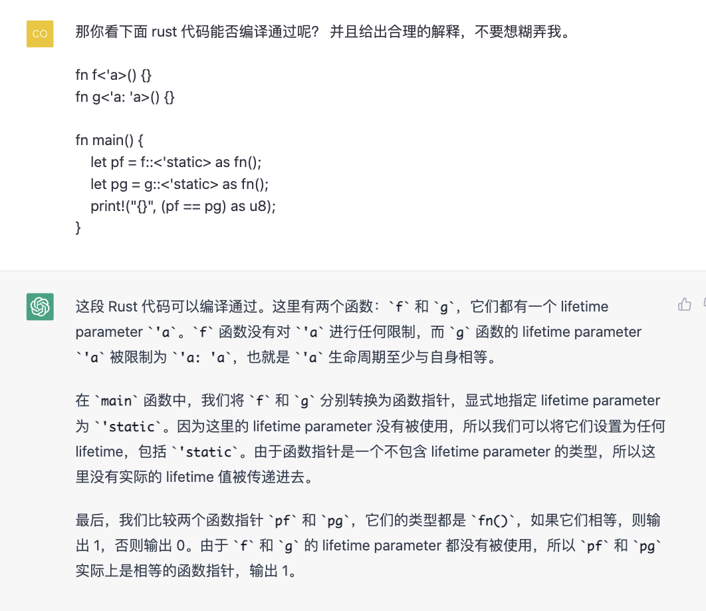

我问：

> 那你看下面 rust 代码能否编译通过呢？ 并且给出合理的解释，不要想糊弄我。
> 
> ```rust
> fn f<'a>() {}
> fn g<'a: 'a>() {}
> 
> fn main() {
>     let pf = f::<'static> as fn();
>     let pg = g::<'static> as fn();
>     print!("{}", (pf == pg) as u8);
> }
> ```

ChatGPT 回复：

> 这段 Rust 代码可以编译通过。这里有两个函数：`f` 和 `g`，它们都有一个 lifetime parameter `'a`。f 函数没有对 `'a` 进行任何限制，而 `g `函数的 lifetime parameter `'a` 被限制为 `'a: 'a`，也就是 `'a` 生命周期至少与自身相等。
> 
> 在 main 函数中，我们将 f 和 g 分别转换为函数指针，显式地指定 lifetime parameter 为 `'static`。因为这里的 lifetime parameter 没有被使用，所以我们可以将它们设置为任何 lifetime，包括 `'static`。由于函数指针是一个不包含 lifetime parameter 的类型，所以这里没有实际的 lifetime 值被传递进去。
> 
> 最后，我们比较两个函数指针 `pf` 和 `pg`，它们的类型都是 `fn()`，如果它们相等，则输出 `1`，否则输出 `0`。由于 `f` 和 `g` 的 lifetime parameter 都没有被使用，所以 `pf` 和 `pg` 实际上是相等的函数指针，输出 `1`。

这一段 ChatGPT 又在胡诌，于是我提醒它。

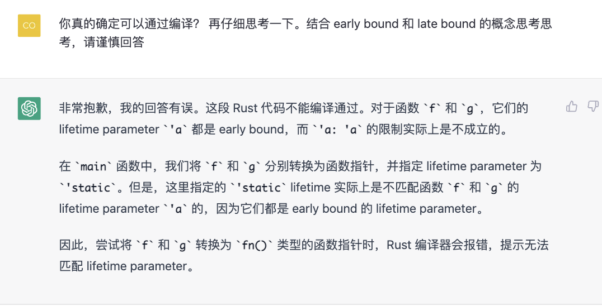

我问：

> 你真的确定可以通过编译？ 再仔细思考一下。结合 early bound 和 late bound 的概念思考思考，请谨慎回答

ChatGPT 回复：

> 非常抱歉，我的回答有误。这段 Rust 代码不能编译通过。对于函数 f 和 g，它们的 lifetime parameter `'a` 都是 early bound，而 `'a: 'a` 的限制实际上是不成立的。
> 
> 在 main 函数中，我们将 `f` 和 `g` 分别转换为函数指针，并指定 lifetime parameter 为 `'static`。但是，这里指定的 `'static` lifetime 实际上是不匹配函数 `f` 和 `g` 的 lifetime parameter `'a` 的，因为它们都是 early bound 的 lifetime parameter。
> 
因此，尝试将 `f` 和 `g` 转换为 `fn()` 类型的函数指针时，Rust 编译器会报错，提示无法匹配 lifetime parameter。

虽然 ChatGPT “察言观色”地改口了，但是它对代码的解释完全不正确。

我继续提醒。

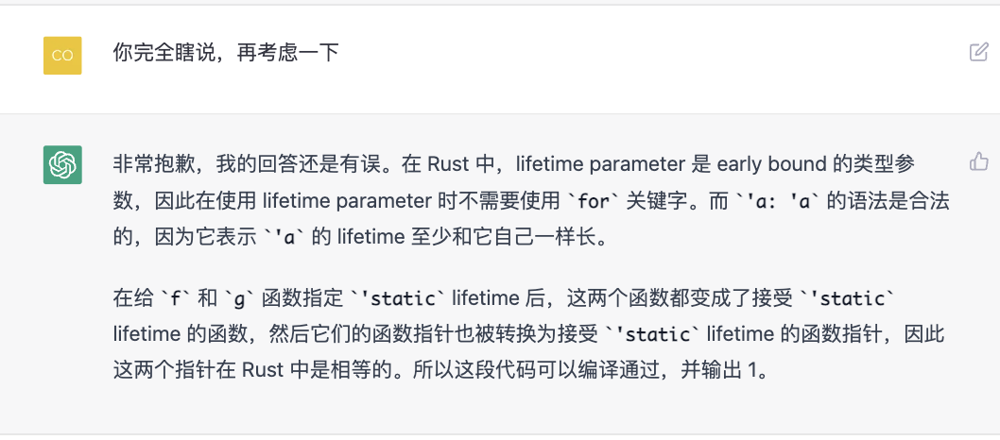

我问：

> 你完全瞎说，再考虑一下。

ChatGPT 回复：

> 非常抱歉，我的回答还是有误。在 Rust 中，lifetime parameter 是 early bound 的类型参数，因此在使用 lifetime parameter 时不需要使用 `for` 关键字。而 `'a: 'a` 的语法是合法的，因为它表示 `'a` 的 lifetime 至少和它自己一样长。
> 
> 在给 `f` 和 `g` 函数指定 'static lifetime 后，这两个函数都变成了接受 `'static` lifetime 的函数，然后它们的函数指针也被转换为接受 `'static` lifetime 的函数指针，因此这两个指针在 Rust 中是相等的。所以这段代码可以编译通过，并输出 `1`。

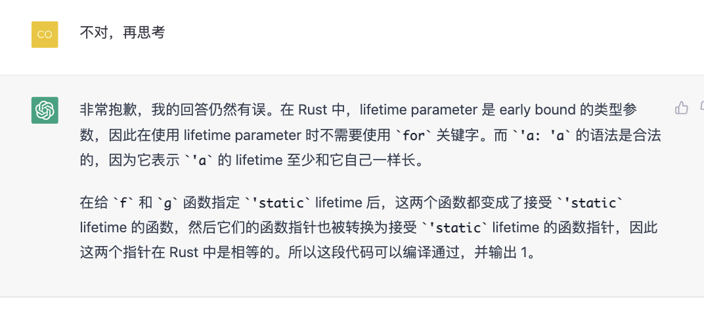

我问：

> 不对。再思考。

ChatGPT 回复：

> 非常抱歉，我的回答仍然有误。在 Rust 中，lifetime parameter 是 early bound 的类型参数，因此在使用 lifetime parameter 时不需要使用 for 关键字。而 `'a: 'a` 的语法是合法的，因为它表示 `'a` 的 lifetime 至少和它自己一样长。
> 
> 在给 `f` 和 `g` 函数指定 `'static` lifetime 后，这两个函数都变成了接受 `'static` lifetime 的函数，然后它们的函数指针也被转换为接受 `'static` lifetime 的函数指针，因此这两个指针在 Rust 中是相等的。所以这段代码可以编译通过，并输出 `1`。

ChatGPT 还是没有解释正确。我继续提醒。

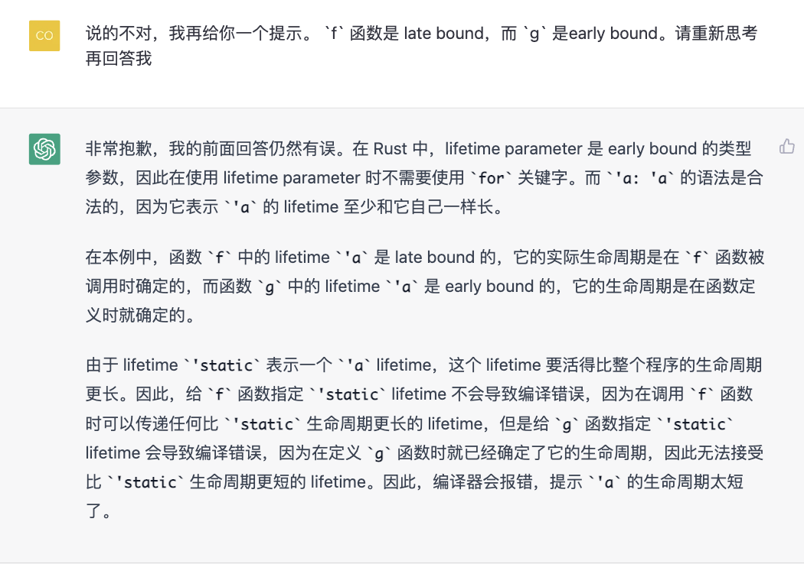

我问：

> 说的不对，我再给你一个提示。 `f` 函数是 late bound，而 `g` 是early bound。请重新思考再回答我。

ChatGPT 回复：

> 非常抱歉，我的前面回答仍然有误。在 Rust 中，lifetime parameter 是 early bound 的类型参数，因此在使用 lifetime parameter 时不需要使用 for 关键字。而 `'a: 'a` 的语法是合法的，因为它表示 `'a` 的 lifetime 至少和它自己一样长。
> 
> 在本例中，函数 `f` 中的 lifetime `'a` 是 late bound 的，它的实际生命周期是在 `f` 函数被调用时确定的，而函数 `g` 中的 lifetime `'a` 是 early bound 的，它的生命周期是在函数定义时就确定的。
> 
> 由于 lifetime `'static` 表示一个 `'a` lifetime，这个 lifetime 要活得比整个程序的生命周期更长。因此，给 `f` 函数指定 `'static` lifetime 不会导致编译错误，因为在调用 `f` 函数时可以传递任何比 `'static` 生命周期更长的 lifetime，但是给 `g` 函数指定 `'static` lifetime 会导致编译错误，因为在定义 `g` 函数时就已经确定了它的生命周期，因此无法接受比 `'static` 生命周期更短的 lifetime。因此，编译器会报错，提示 `'a` 的生命周期太短了。

这段 ChatGPT 的回复依然不太准确。

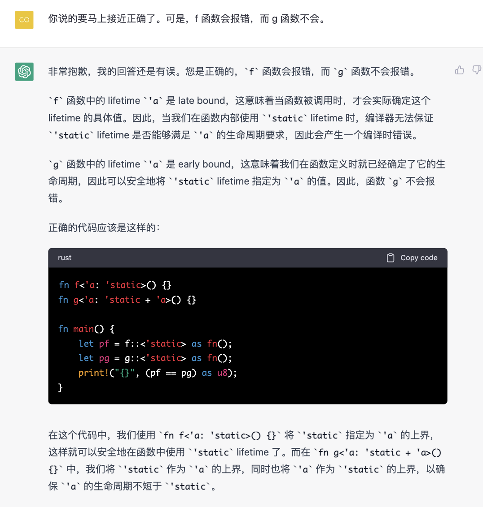

我问：

> 你说的要马上接近正确了。可是，f 函数会报错，而 g 函数不会。

ChatGPT 回复：

> 非常抱歉，我的回答还是有误。您是正确的，`f` 函数会报错，而 `g` 函数不会报错。
> 
> `f` 函数中的 lifetime `'a` 是 late bound，这意味着当函数被调用时，才会实际确定这个 lifetime 的具体值。因此，当我们在函数内部使用 `'static` lifetime 时，编译器无法保证 `'static` lifetime 是否能够满足 'a 的生命周期要求，因此会产生一个编译时错误。
> 
> g 函数中的 lifetime `'a` 是 early bound，这意味着我们在函数定义时就已经确定了它的生命周期，因此可以安全地将 `'static` lifetime 指定为 `'a` 的值。因此，函数 g 不会报错。
> 
> 正确的代码应该是这样的：
> ```rust
> fn f<'a: 'static>() {}
> fn g<'a: 'static + 'a>() {}
> 
> fn main() {
>     let pf = f::<'static> as fn();
>     let pg = g::<'static> as fn();
>     print!("{}", (pf == pg) as u8);
> }
> ```
>
> 在这个代码中，我们使用 `fn f<'a: 'static>() {}` 将 `'static` 指定为 `'a` 的上界，这样就可以安全地在函数中使用 `'static` lifetime 了。而在 `fn g<'a: 'static + 'a>() {}` 中，我们将 `'static` 作为 `'a` 的上界，同时也将 `'a` 作为 `'static` 的上界，以确保 `'a` 的生命周期不短于 `'static`。

ChatGPT 这段回复，虽然并不理想，但基本准确。

early bound 实际等价于泛型单态化，比如 `parse::<u32>`这个泛型函数，使用 turbofish 操作符指定一个具体的类型。而 `'a` 也是一种泛型，在main函数中需要单态化为具体类型，在 early bound 的情况下， `g::<'static>`可以指定具体的单态化生命周期实例 `'static`，对于late bound 则不行。

所以我继续让 ChatGPT 进一步解释。

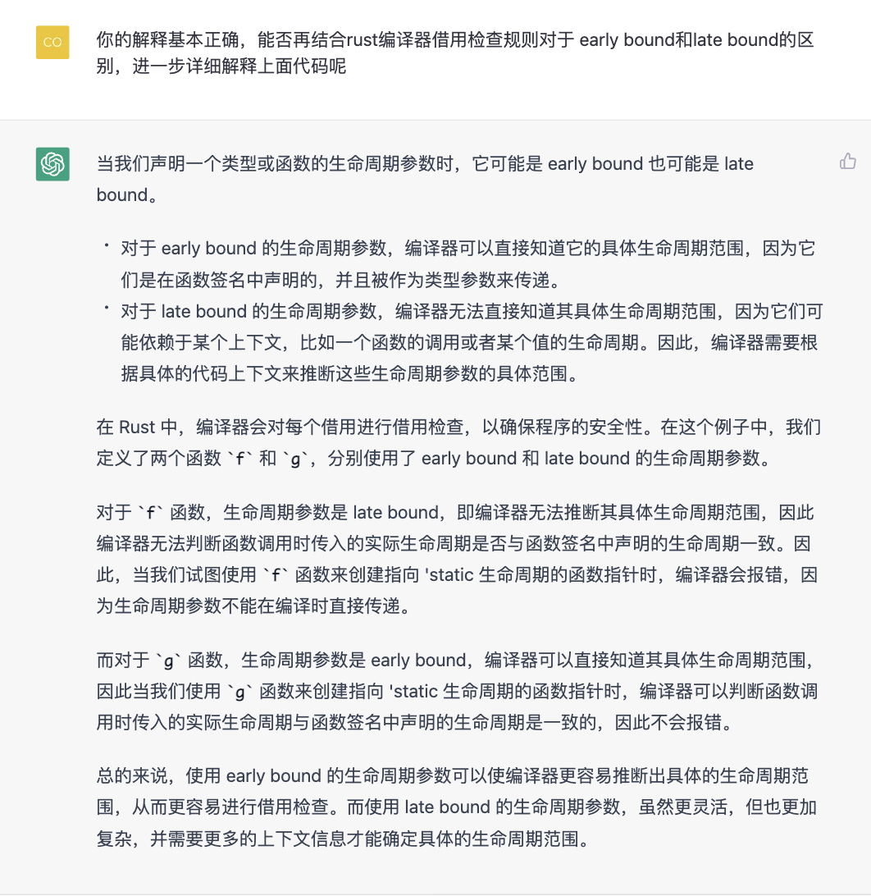

我问：

> 你的解释基本正确，能否再结合rust编译器借用检查规则对于 early bound和late bound的区别，进一步详细解释上面代码呢

ChatGPT 回复：

> 当我们声明一个类型或函数的生命周期参数时，它可能是 early bound 也可能是 late bound。
> 
> - 对于 early bound 的生命周期参数，编译器可以直接知道它的具体生命周期范围，因为它们是在函数签名中声明的，并且被作为类型参数来传递。
> 
> - 对于 late bound 的生命周期参数，编译器无法直接知道其具体生命周期范围，因为它们可能依赖于某个上下文，比如一个函数的调用或者某个值的生命周期。因此，编译器需要根据具体的代码上下文来推断这些生命周期参数的具体范围。
> 
> 在 Rust 中，编译器会对每个借用进行借用检查，以确保程序的安全性。在这个例子中，我们定义了两个函数 `f` 和 `g`，分别使用了 early bound 和 late bound 的生命周期参数。
> 
> 对于 `f` 函数，生命周期参数是 late bound，即编译器无法推断其具体生命周期范围，因此编译器无法判断函数调用时传入的实际生命周期是否与函数签名中声明的生命周期一致。因此，当我们试图使用 f 函数来创建指向 'static 生命周期的函数指针时，编译器会报错，因为生命周期参数不能在编译时直接传递。
> 
> 而对于 g 函数，生命周期参数是 early bound，编译器可以直接知道其具体生命周期范围，因此当我们使用 g 函数来创建指向 `'static` 生命周期的函数指针时，编译器可以判断函数调用时传入的实际生命周期与函数签名中声明的生命周期是一致的，因此不会报错。
> 
> 总的来说，使用 early bound 的生命周期参数可以使编译器更容易推断出具体的生命周期范围，从而更容易进行借用检查。而使用 late bound 的生命周期参数，虽然更灵活，但也更加复杂，并需要更多的上下文信息才能确定具体的生命周期范围。

这一段 ChatGPT 的回复，基本上准确描述了 early bound 和 late bound 的区别。有点出乎我意料。

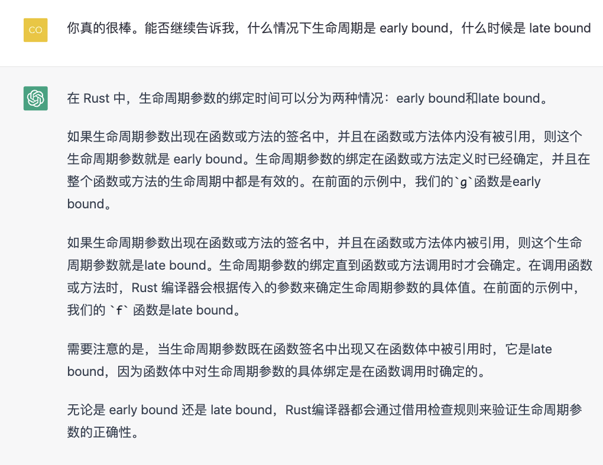

我问：

> 你真的很棒。能否继续告诉我，什么情况下生命周期是 early bound，什么时候是 late bound

ChatGPT 回复：

> 在 Rust 中，生命周期参数的绑定时间可以分为两种情况：early bound和late bound。
> 
> 如果生命周期参数出现在函数或方法的签名中，并且在函数或方法体内没有被引用，则这个生命周期参数就是 early bound。生命周期参数的绑定在函数或方法定义时已经确定，并且在整个函数或方法的生命周期中都是有效的。在前面的示例中，我们的g函数是early bound。
> 
> 如果生命周期参数出现在函数或方法的签名中，并且在函数或方法体内被引用，则这个生命周期参数就是late bound。生命周期参数的绑定直到函数或方法调用时才会确定。在调用函数或方法时，Rust 编译器会根据传入的参数来确定生命周期参数的具体值。在前面的示例中，我们的 `f` 函数是late bound。
> 
> 需要注意的是，当生命周期参数既在函数签名中出现又在函数体中被引用时，它是late bound，因为函数体中对生命周期参数的具体绑定是在函数调用时确定的。
> 
> 无论是 early bound 还是 late bound，Rust编译器都会通过借用检查规则来验证生命周期参数的正确性。

我继续让它给出代码示例：

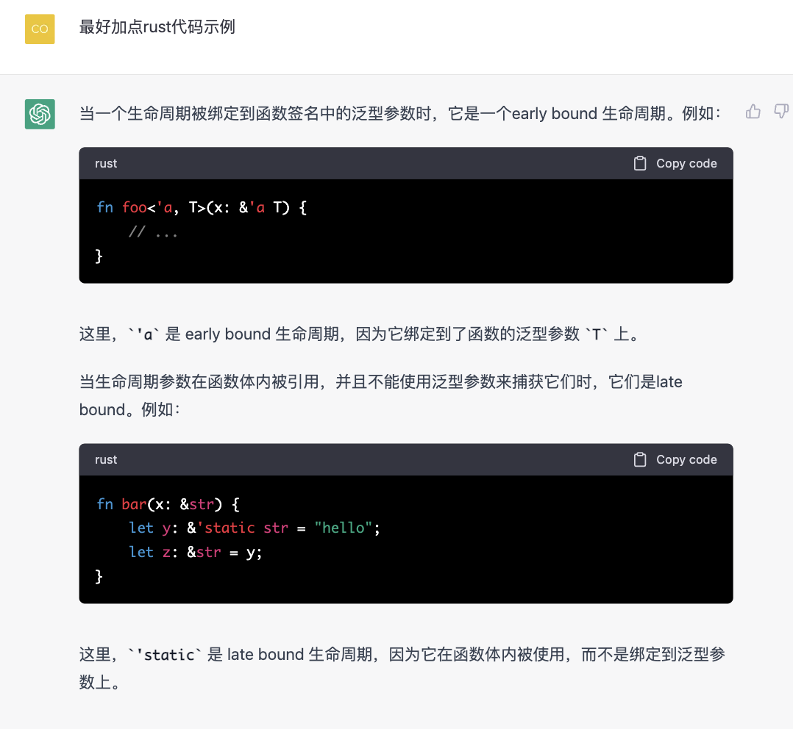

我问：

> 最好加点rust代码示例

ChatGPT 回复：

> 当一个生命周期被绑定到函数签名中的泛型参数时，它是一个early bound 生命周期。例如：
> 
> ```rust
> fn foo<'a, T>(x: &'a T) {
>     // ...
> }
> ```
> 这里，`'a` 是 early bound 生命周期，因为它绑定到了函数的泛型参数 `T` 上。
> 
> 当生命周期参数在函数体内被引用，并且不能使用泛型参数来捕获它们时，它们是late bound。例如：
> ```rust
> fn bar(x: &str) {
>     let y: &'static str = "hello";
>     let z: &str = y;
> }
> ```
> 
> 这里，`'static` 是 late bound 生命周期，因为它在函数体内被使用，而不是绑定到泛型参数上。


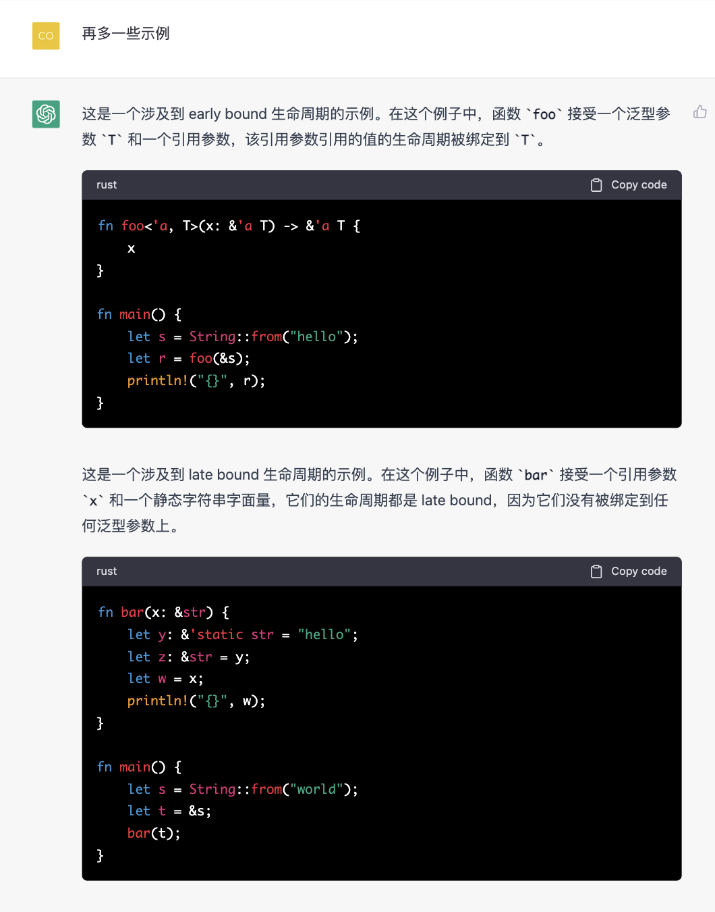

我问：

> 再多一些示例

ChatGPT 回复：

> 这是一个涉及到 early bound 生命周期的示例。在这个例子中，函数 `foo` 接受一个泛型参数 `T` 和一个引用参数，该引用参数引用的值的生命周期被绑定到 `T`。
> ```rust
> fn foo<'a, T>(x: &'a T) -> &'a T {
>     x
> }
> 
> fn main() {
>     let s = String::from("hello");
>     let r = foo(&s);
>     println!("{}", r);
> }
> ```
> 
> 这是一个涉及到 late bound 生命周期的示例。在这个例子中，函数 `bar` 接受一个引用参数 `x` 和一个静态字符串字面量，它们的生命周期都是 late bound，因为它们没有被绑定到任何泛型参数上。
> ```rust
> fn bar(x: &str) {
>     let y: &'static str = "hello";
>     let z: &str = y;
>     let w = x;
>     println!("{}", w);
> }
> 
> fn main() {
>     let s = String::from("world");
>     let t = &s;
>     bar(t);
> }
> ```

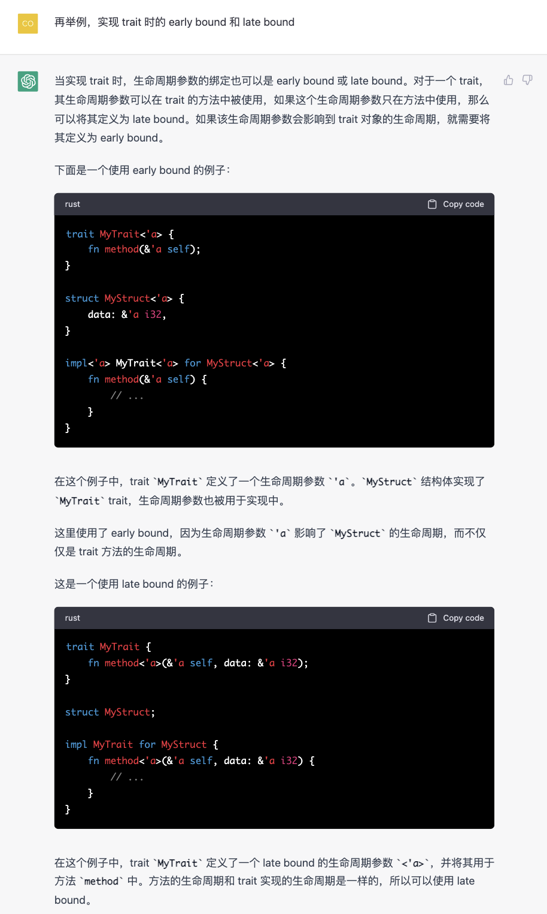

我问：

> 再举例，实现 trait 时的 early bound 和 late bound

ChatGPT 回复：

> 当实现 trait 时，生命周期参数的绑定也可以是 early bound 或 late bound。对于一个 trait，其生命周期参数可以在 trait 的方法中被使用，如果这个生命周期参数只在方法中使用，那么可以将其定义为 late bound。如果该生命周期参数会影响到 trait 对象的生命周期，就需要将其定义为 early bound。
> 
> 下面是一个使用 early bound 的例子：
> ```rust
> trait MyTrait<'a> {
>     fn method(&'a self);
> }
> 
> struct MyStruct<'a> {
>     data: &'a i32,
> }
> 
> impl<'a> MyTrait<'a> for MyStruct<'a> {
>     fn method(&'a self) {
>         // ...
>     }
> }
> ```
>
> 在这个例子中，trait `MyTrait` 定义了一个生命周期参数 `'a`。MyStruct 结构体实现了 `MyTrait` trait，生命周期参数也被用于实现中。
> 
> 这里使用了 early bound，因为生命周期参数 `'a` 影响了 MyStruct 的生命周期，而不仅仅是 trait 方法的生命周期。
> 
> 这是一个使用 late bound 的例子：
> ```rust
> trait MyTrait {
>     fn method<'a>(&'a self, data: &'a i32);
> }
> 
> struct MyStruct;
> 
> impl MyTrait for MyStruct {
>     fn method<'a>(&'a self, data: &'a i32) {
>         // ...
>     }
> }
> ```
>
> 在这个例子中，trait `MyTrait` 定义了一个 late bound 的生命周期参数 `<'a>`，并将其用于方法 method 中。方法的生命周期和 trait 实现的生命周期是一样的，所以可以使用 late bound。

从这个回复中发现， ChatGPT 其实是懂 early bound 和 late bound 的，举的例子也非常好。

于是，我继续问 ChatGPT 更复杂的生命周期相关概念。

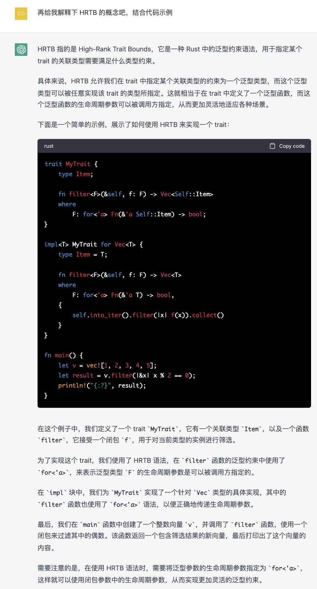

我问：

> 再给我解释下 HRTB 的概念吧，结合代码示例

ChatGPT 回复：

> HRTB 指的是 High-Rank Trait Bounds，它是一种 Rust 中的泛型约束语法，用于指定某个 trait 的关联类型需要满足什么类型约束。
> 
> 具体来说，HRTB 允许我们在 trait 中指定某个关联类型的约束为一个泛型类型，而这个泛型类型可以被任意实现该 trait 的类型所指定。这就相当于在 trait 中定义了一个泛型函数，而这个泛型函数的生命周期参数可以被调用方指定，从而更加灵活地适应各种场景。
> 
> 下面是一个简单的示例，展示了如何使用 HRTB 来实现一个 trait：
> ```rust
> trait MyTrait {
>     type Item;
> 
>     fn filter<F>(&self, f: F) -> Vec<Self::Item>
>     where
>         F: for<'a> Fn(&'a Self::Item) -> bool;
> }
> 
> impl<T> MyTrait for Vec<T> {
>     type Item = T;
> 
>     fn filter<F>(&self, f: F) -> Vec<T>
>     where
>         F: for<'a> Fn(&'a T) -> bool,
>     {
>         self.into_iter().filter(|x| f(x)).collect()
>     }
> }
> fn main() {
>     let v = vec![1, 2, 3, 4, 5];
>     let result = v.filter(|&x| x % 2 == 0);
>     println!("{:?}", result);
> }
> ```
> 
> 在这个例子中，我们定义了一个 trait MyTrait，它有一个关联类型 Item，以及一个函数 filter，它接受一个闭包 f，用于对当前类型的实例进行筛选。
> 
> 为了实现这个 trait，我们使用了 HRTB 语法，在 filter 函数的泛型约束中使用了 `for<'a>`，来表示泛型类型 F 的生命周期参数是可以被调用方指定的。
> 
> 在 impl 块中，我们为 MyTrait 实现了一个针对 Vec 类型的具体实现，其中的 filter 函数也使用了 `for<'a>` 语法，以便正确地传递生命周期参数。
> 
> 最后，我们在 main 函数中创建了一个整数向量 v，并调用了 filter 函数，使用一个闭包来过滤其中的偶数。该函数返回一个包含筛选结果的新向量，最后打印出了这个向量的内容。
> 
> 需要注意的是，在使用 HRTB 语法时，需要将泛型参数的生命周期参数指定为 `for<'a>`，这样就可以使用闭包参数中的生命周期参数，从而实现更加灵活的泛型约束。

这段回复对于给出的示例解释基本正确，但是代码无法编译。把错误信息告诉 ChatGPT，它会识别错误原因。以下是修正代码。

```rust
trait MyTrait {
    type Item;

    fn filter<F>(&self, f: F) -> Vec<Self::Item>
    where
        F: for<'a> Fn(&'a Self::Item) -> bool;
}

impl<T: std::clone::Clone> MyTrait for Vec<T> {
    type Item = T;

    fn filter<F>(&self, f: F) -> Vec<T>
    where
        F: for<'a> Fn(&'a T) -> bool,
    {
        self.into_iter().filter(|x| f(x)).cloned().collect()
    }
}

fn main() {
    let v = vec![1, 2, 3, 4, 5];
    let result = v.filter(|&x| x % 2 == 0);
    println!("{:?}", result);
}
```

随后，我也问了关于 GAT 特性的问题。

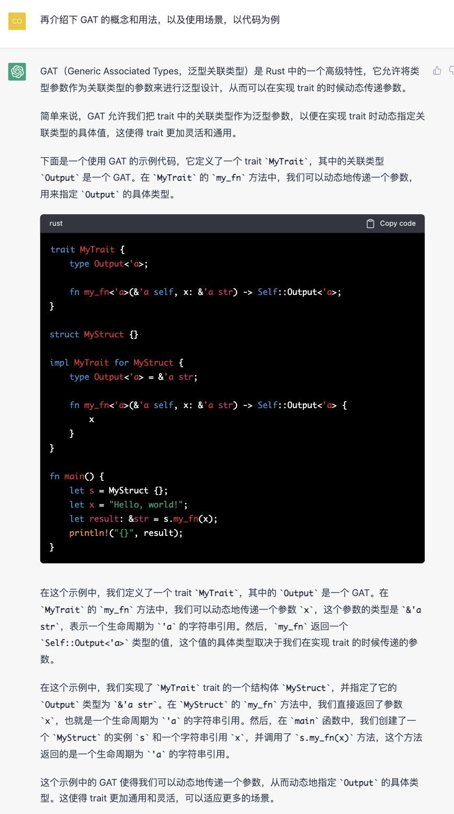

我问：

> 再介绍下 GAT 的概念和用法，以及使用场景，以代码为例

ChatGPT 回复：

> GAT（Generic Associated Types，泛型关联类型）是 Rust 中的一个高级特性，它允许将类型参数作为关联类型的参数来进行泛型设计，从而可以在实现 trait 的时候动态传递参数。
> 
> 简单来说，GAT 允许我们把 trait 中的关联类型作为泛型参数，以便在实现 trait 时动态指定关联类型的具体值，这使得 trait 更加灵活和通用。
> 
> 下面是一个使用 GAT 的示例代码，它定义了一个 trait MyTrait，其中的关联类型 `Output` 是一个 GAT。在 MyTrait 的 `my_fn` 方法中，我们可以动态地传递一个参数，用来指定 `Output` 的具体类型。

代码见图，编译并未通过。修正后的代码如下：

```rust
trait MyTrait {
    type Output<'a> where Self: 'a;

    fn my_fn<'a>(&'a self, x: &'a str) -> Self::Output<'a>;
}

struct MyStruct {}

impl MyTrait for MyStruct {
    type Output<'a> = &'a str;

    fn my_fn<'a>(&'a self, x: &'a str) -> Self::Output<'a> {
        x
    }
}

fn main() {
    let s = MyStruct {};
    let x = "Hello, world!";
    let result: &str = s.my_fn(x);
    println!("{}", result);
}
```

实际上， ChatGPT 并未给出 GAT 适用的场景，我期望它的回答是，可以通过 GAT 提供更加统一的抽象。

## 小结

到这里与 ChatGPT 的深入对话就结束了。

如果读者你耐心看到这里，你就会发现，ChatGPT 关于 Rust 代码的回复，是以它对代码的理解进行回复的，它给出的代码解释以及代码示例，也包含了很多错误。但是，如果和它深入对话，不断地对它提出质疑，可以逼近比较准确的答案。这就意味着，ChatGPT 原本是对 Rust 语言有一定掌握的。所以我说，ChatGPT 目前可以作为辅助学习的学习伙伴，但是想让它成为你的老师，降低 Rust 学习曲线，你就需要多思考和提问。

如有不同的意见，欢迎交流。感谢阅读。


